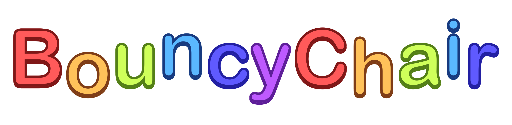

# Intro

Bouncy Chair is a web application written with Vue 3 and Vuex intended to simplify the use of "reactive avatars" with Discord voice chats and OBS. It has been tested with Streamlabs OBS and Discord StreamKit; while it may be possible to adapt its output to other configurations this usage is not supported.

# Credits

- Ollie icon by [tinyaliem](https://www.twitter.com/tinyaliem)
- Example avatars and Bouncy Chair logo by [slimedrops](https://www.twitter.com/slimedrops)
